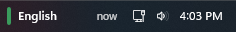
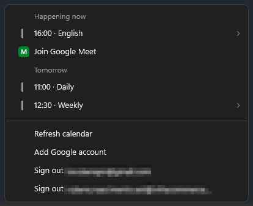

# Tray Agenda

A calendar agenda widget for the Windows 11 system tray, built as a single-file
[Windhawk](https://windhawk.net) mod. No helper program is needed.

- Tray widget with the current or next meeting. An event starting within the reminder lead
  time takes over from the one in progress; out-of-office events never win over an
  overlapping regular event.
- Notion-Calendar-style popup agenda grouped by day, with a dotted bar for events you have not
  answered yet.
- Join buttons for Google Meet, Zoom and Microsoft Teams.
- Native Windows toast reminders for accepted events, before the start (10 minutes by default)
  and at the start time.
- Up to 4 Google Calendar accounts plus ICS feeds. The same meeting in two sources is shown once.

## Install

1. In Windhawk choose *Create a new mod*, paste [`tray-agenda.wh.cpp`](tray-agenda.wh.cpp) and compile.
2. Create a Google Cloud *Desktop app* OAuth client (steps below). ICS-only users can skip this.
3. Paste the client ID and secret in the mod settings, then click the tray widget and choose
   **Sign in with Google**.

## Google setup

Every user creates their own OAuth client; nothing is shared.

1. Open <https://console.cloud.google.com/> and create a project (or pick one).
2. **APIs & Services > Library**: enable the **Google Calendar API**.
3. **OAuth consent screen** (*Google Auth Platform* in newer consoles): choose **External**, fill in
   an app name and your email, and save.
4. Add your Google account as a **test user**. To avoid sign-ins expiring every 7 days, set the
   publishing status to **In production**; Google then shows an "unverified app" warning that you can accept.
5. **Credentials > Create credentials > OAuth client ID**, type **Desktop app**. Copy the client ID and secret.

Use **Add Google account** in the popup to connect more accounts (the same client works for all).
If a Workspace admin restricts third-party apps, they may need to allow the client.

By default the mod reads the calendars ticked in Google Calendar. To choose specific calendars, add their
IDs to *Calendar IDs*.

## ICS feeds

Add secret calendar URLs under *ICS feed URLs*, one per item, as `https://...` or `Label|https://...`
(`webcal://` works too). ICS carries no accept/decline status, so every timed feed event gets reminders
unless you turn off *Remind for ICS feed events*. Supported: RRULE (DAILY/WEEKLY/MONTHLY/YEARLY with
INTERVAL, COUNT, UNTIL, BYDAY incl. ordinals, BYMONTHDAY, BYMONTH, WKST), EXDATE, RDATE, RECURRENCE-ID
overrides, and TZID zones (IANA via Windows.Globalization, Windows names via the registry). BYSETPOS is
not supported. Feed URLs are stored as plain text in Windhawk's settings, so treat them as secrets.

## Privacy and security

- Scopes: `calendar.events.readonly` and `calendar.calendarlist.readonly`.
- Sign-in uses the system browser, a loopback redirect on `127.0.0.1` and PKCE. Refresh tokens are encrypted
  with DPAPI for your Windows account and stored in Windhawk's mod storage.
- The client secret is stored in Windhawk's settings like any other setting; for a Desktop-app client it is
  not a confidential secret.
- Traffic goes to Google and to the ICS feed URLs you configure, over HTTPS only (up to 4 redirects are
  followed, which may lead to other HTTPS hosts). Nothing is sent until you configure an OAuth client and
  sign in, or add an ICS URL. Meeting links are shown only if they match a strict allowlist (Google Meet,
  `zoom.us`, Microsoft Teams).
- Reminders use their own notification identity, so they appear as "Tray Agenda". The first time a reminder
  is about to be shown, the mod writes `HKCU\Software\Classes\AppUserModelId\TrayAgenda` (display name only),
  and Windows adds `HKCU\Software\Microsoft\Windows\CurrentVersion\Notifications\Settings\TrayAgenda`. Both
  are deleted when the mod is disabled or unloaded, and leftovers from an unclean exit are deleted at the next
  start. Nothing is written if no reminder is ever shown. Per-app notification choices made in Windows Settings
  are discarded together with those keys; use the mod's own *Reminder notifications* setting instead.
- *Sign out ...* in the popup removes that account's token and revokes it at Google.

## Implementation notes

- Every network call, the sign-in listener and the reminder scheduler run on worker threads; unloading the
  mod aborts in-flight requests and joins all threads.
- Google expands recurring events itself (`singleEvents=true`); ICS recurrences are expanded in the mod.

## Tests

`tests/run-logic-tests.sh` (WSL) compiles the mod source with `tests/logic_tests.cpp` using the Windhawk
compiler and runs the pure logic: RFC 3339 parsing, PKCE (RFC 7636 vector), DPAPI round trip, link allowlist,
widget selection, reminder windows, Google event mapping and ICS parsing (with the real Windows time zone
APIs). It does not exercise the network, the taskbar XAML or toast delivery; check those manually in Windhawk.

## License

[MIT](LICENSE). Third-party attributions are in [THIRD_PARTY_NOTICES.md](THIRD_PARTY_NOTICES.md).
